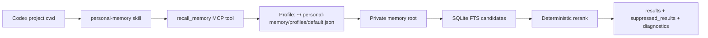

# Architecture

## Components

| Component | Path | Purpose |
| --- | --- | --- |
| Codex marketplace | `.agents/plugins/marketplace.json` | Lets Codex discover the local plugin after clone |
| Plugin manifest | `plugins/personal-memory/.codex-plugin/plugin.json` | Plugin metadata, skill path, MCP config path |
| Skill | `plugins/personal-memory/skills/personal-memory/SKILL.md` | Tells Codex when and how to recall memory |
| MCP server | `plugins/personal-memory/scripts/personal_memory_mcp.py` | Exposes recall/search/eval/refresh tools |
| CLI | `plugins/personal-memory/scripts/memory_query.py` | Query interface for humans and tests |
| Profile loader | `plugins/personal-memory/scripts/memory_config.py` | Resolves `~/.personal-memory/profiles/*.json` |
| Indexer | `plugins/personal-memory/memory_graph/indexer.py` | Builds SQLite nodes, FTS table, and graph edges |

## Data Flow

## Ranking Signals

The reranker keeps search deterministic and explainable:

- `alias/cwd` hit boost
- `title/source_path` exact hit boost
- project Markdown and project node preference
- exact skill-name boost
- profile boost for personal-background queries
- broad memory suppression for `conversations.md`, project indexes, and generic design chats

## Why No Embeddings By Default

The first optimization target is reliability, not semantic breadth. SQLite FTS plus deterministic rerank is:

- local and dependency-light
- easy to debug
- explainable through `reasons`
- cheap to evaluate

Embedding search can be added later once a larger eval set proves the ROI.

